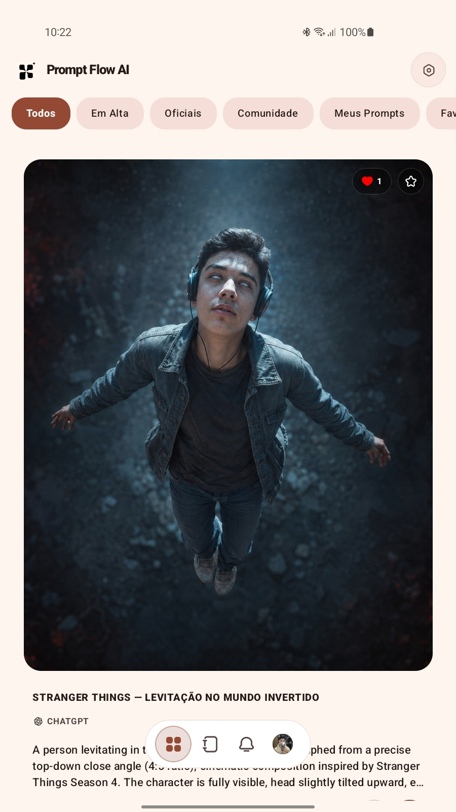

# Prompt Flow AI

  

**Uma plataforma para descobrir, criar, publicar, organizar e interagir com prompts de inteligência artificial.**

---

## Sobre o Prompt Flow AI

O **Prompt Flow AI** é uma plataforma desenvolvida para tornar a utilização de prompts de inteligência artificial mais organizada, acessível e interativa.

A plataforma reúne recursos de descoberta, publicação e organização de prompts em uma experiência que combina conteúdo, perfis de usuários e interações sociais.

O objetivo é oferecer um espaço onde usuários possam encontrar prompts, conhecer diferentes conteúdos, publicar seus próprios trabalhos e acompanhar outros perfis.

---

## Visão geral

O Prompt Flow AI foi estruturado em torno de uma experiência simples:

**Descobrir → Explorar → Interagir → Salvar → Publicar**

A plataforma permite que o usuário navegue pela galeria, visualize prompts em detalhes, interaja com conteúdos, salve seus favoritos e acompanhe outros usuários.

---

## Download

### Versão oficial mais recente

O aplicativo é distribuído por meio dos **GitHub Releases** oficiais do Prompt Flow AI.

> O botão abaixo sempre direciona para o release oficial mais recente. Versões marcadas como **Pre-release** ou **Draft** não são consideradas versões oficiais.

**[Baixar o APK](https://github.com/MANOSHOXFF/prompt-flow---ai/releases/latest)** · **[Ver todos os releases](https://github.com/MANOSHOXFF/prompt-flow---ai/releases)**

---

## Principais recursos

### Galeria

Área principal de descoberta de conteúdo, permitindo navegar pelos prompts disponíveis na plataforma.

A galeria reúne diferentes categorias e áreas de conteúdo, incluindo:

- Todos
- Em Alta
- Oficiais
- Comunidade
- Meus Prompts
- Favoritos

### Publicação de prompts

Os usuários podem publicar seus próprios prompts dentro da plataforma, permitindo compartilhar conteúdos com a comunidade.

### Curtidas

Sistema de interação que permite demonstrar interesse pelos prompts publicados.

### Favoritos

Permite salvar prompts para facilitar o acesso posteriormente.

### Perfis de usuários

Cada usuário possui uma área de perfil destinada à apresentação de suas informações e conteúdos publicados.

O perfil também apresenta informações relacionadas à atividade do usuário na plataforma.

### Seguir usuários

Permite acompanhar outros perfis e manter uma experiência mais personalizada dentro da plataforma.

### Notificações

Sistema destinado a informar o usuário sobre atividades relevantes relacionadas à sua conta e às interações realizadas na plataforma.

### Sistema de níveis de conta

A plataforma possui um sistema de progressão associado à atividade das contas.

Os níveis fazem parte da experiência de perfil e representam diferentes estágios dentro da plataforma.

### Personalização

O aplicativo oferece opções de personalização da aparência para adaptar a experiência visual às preferências do usuário.

A plataforma disponibiliza diferentes opções de temas visuais, permitindo personalizar a interface sem expor os nomes específicos dessas opções.

Também é possível escolher o modo de aparência do aplicativo:

- **Sistema** — acompanha a configuração de aparência do dispositivo.
- **Escuro** — utiliza a interface em modo escuro.
- **Claro** — utiliza a interface em modo claro.

### Compatibilidade com diferentes telas

A interface foi projetada para funcionar em diferentes tamanhos de tela, incluindo dispositivos móveis e tablets.

---

# Interface

## Galeria

A galeria funciona como o principal espaço de descoberta do Prompt Flow AI, permitindo navegar pelos conteúdos disponíveis na plataforma.

---

## Detalhes do prompt

A tela de detalhes apresenta as informações do prompt, incluindo imagem, título, autor, interações e conteúdo.

---

## Perfil do usuário

A área de perfil reúne informações da conta e os conteúdos publicados pelo usuário.

---

# Experiência do usuário

A experiência do Prompt Flow AI foi organizada para reduzir a complexidade durante a navegação.

O fluxo principal permite:

1. Acessar a galeria.
2. Descobrir prompts.
3. Abrir os detalhes de um conteúdo.
4. Interagir com o prompt.
5. Salvar conteúdos nos favoritos.
6. Visitar o perfil do autor.
7. Seguir outros usuários.
8. Publicar seus próprios prompts.
9. Acompanhar atividades por meio das notificações.

---

**Prompt Flow AI**

© Prompt Flow AI. Todos os direitos reservados.

